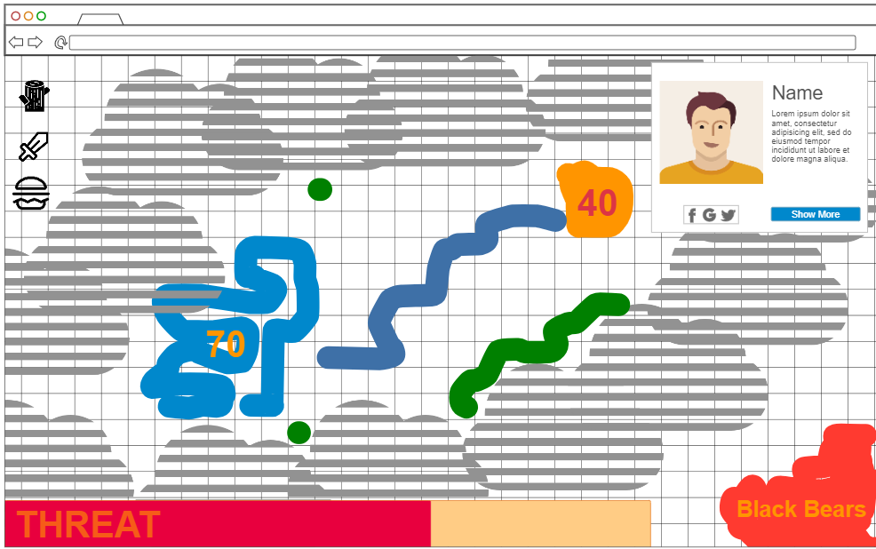

# cs260-startup
[Notes](notes.md)

This website will feature a real-time cooperative PvE multiplayer game in which players manage settlements and defend against enemy spawns dictated by new animal sightings from the iNaturalist API.
This is a slow-paced game with a very large map, where players will be encouraged to cooperate with anyone that they can find to defend against enemies.
There will be resource deposits, and players will be able to capture territory and manage relatively simple settlements and combat.
The game will be designed so that players are not able to act against each others interest.

- HTML - Uses correct HTML structure for application. Three HTML pages. One for login, one for game stats and one for gameplay.
- CSS - Application styling that looks good on different screen sizes, uses good whitespace, color choice and contrast.
- JavaScript - Provides login, gameplay view, stats display, backend endpoint calls.
- React - Single page application with views componentized and reactive to user's actions.
- Service - Backend service with endpoints for:
  - retrieving game state
  - submitting player actions
  - retrieving statistics
- Create enemy spawns based off of confirmed wildlife sightings from the iNaturalist API.
- DB/Login - Store users, resources/territory ownership and map data in database. Register and login users. Credentials securely stored in database. Can't play without being logged into an account.
- WebSocket - Player actions affect board in real time, board updates are recieved in real time.